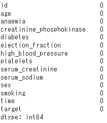
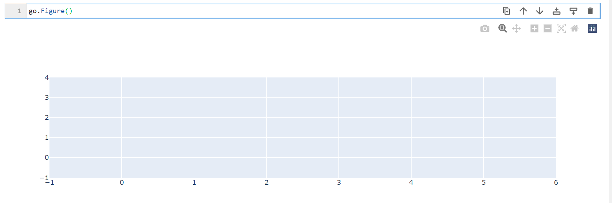
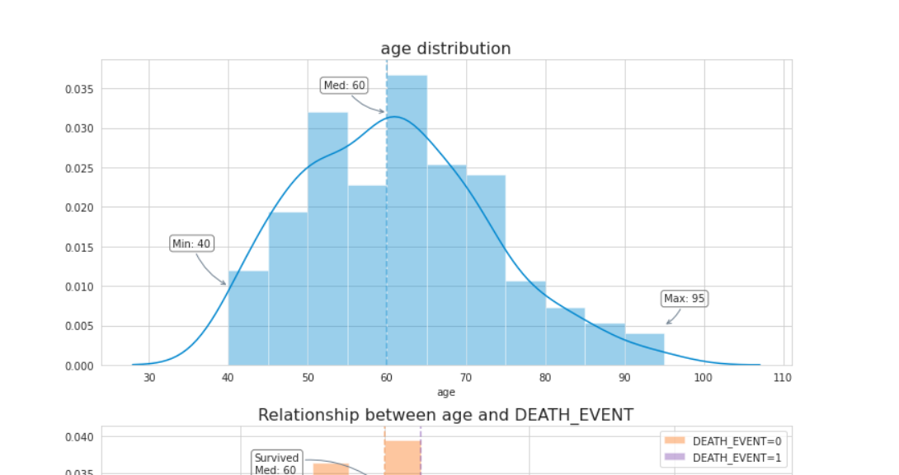
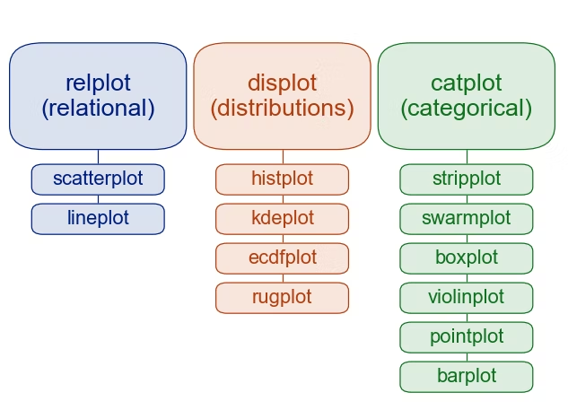
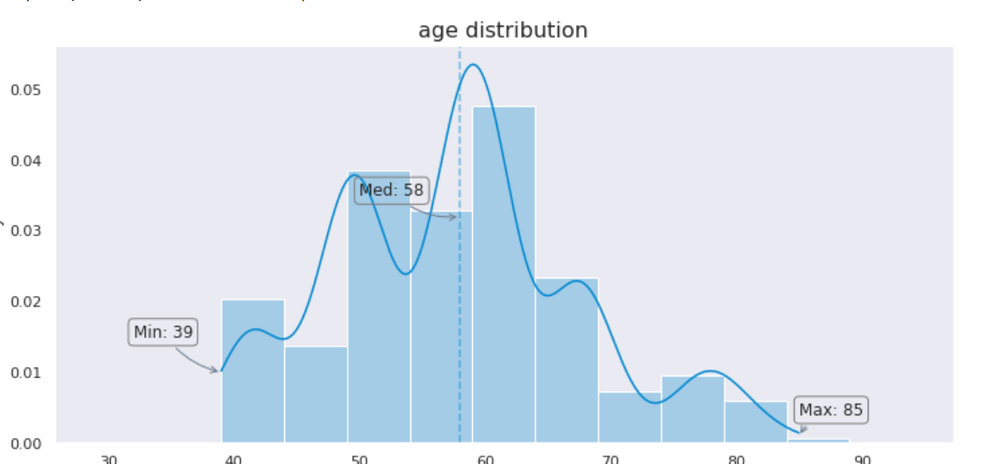
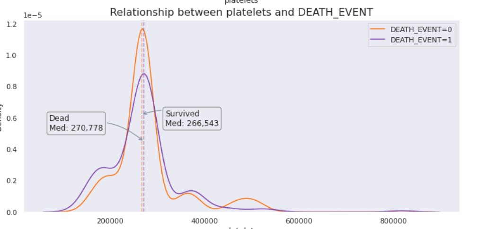

# 表データ 可視化パイプライン・手法

pandasを読み込む

**最初のステップ**
1. (データの量, 説明変数の数)
2. データ概要

```python
train_path = "./data/train.csv"
df = pd.read_csv(train_path)
print("Data shape :", df.shape)
df.head()
```

**欠損価の確認**

```python
df.isnull().sum()
```


**データの偏りを確認する**

`sns.countplot`を使用してOHEされたデータの偏りを確認する.

```python
fig, ((ax1, ax2, ax3), (ax4, ax5, ax6)) = plt.subplots(2, 3, figsize=(16, 12))

sns.countplot(x="anaemia", ax=ax1, data=df,
              palette=palette_ro[3::-3], alpha=0.9)
sns.countplot(x="diabetes", ax=ax2, data=df,
              palette=palette_ro[3::-3], alpha=0.9)
sns.countplot(x="high_blood_pressure", ax=ax3, data=df,
              palette=palette_ro[3::-3], alpha=0.9)
sns.countplot(x="sex", ax=ax4, data=df,
              palette=palette_ro[2::3], alpha=0.9)
sns.countplot(x="smoking", ax=ax5, data=df,
              palette=palette_ro[3::-3], alpha=0.9)
sns.countplot(x="target", ax=ax6, data=df,
              palette=palette_ro[1::5], alpha=0.9)
```

- `palette` で色を変更
- `alpha` は0.9にしておくのが丸い
- `((ax1, ax2, ax3), (ax4, ax5, ax6))` でグラフの並びを調整する

**ターゲットとのカテゴリの関係** 

OHEされたカテゴリとターゲットとの関係を棒グラフで可視化する

`Plotly` を使用する

```python
bin_features = ["anaemia", "diabetes", "high_blood_pressure", "sex", "smoking"]

df_d = pd.DataFrame(columns=[0, 1, "value"])
for col in bin_features:
    for u in df[col].unique():
        df_d.loc[col+"_"+str(u)] = 0
        for i in df["target"].unique():
            if u == 0:
                df_d["value"][col+"_"+str(u)] = "0 (False)"
            else:
                df_d["value"][col+"_"+str(u)] = "1 (True)"
            df_d[i][col+"_"+str(u)] = df[df[col]==u]["target"].value_counts(normalize=True)[i] * 100

df_d = df_d.reindex(index=["anaemia_0", "anaemia_1", "diabetes_0", "diabetes_1", "high_blood_pressure_0", "high_blood_pressure_1",
                           "sex_0", "sex_1", "smoking_0", "smoking_1"])
df_d.at["sex_0", "value"] = "0 (Female)"
df_d.at["sex_1", "value"] = "1 (Male)"

#とりあえずここまでよんだ

fig = go.Figure(data=[
    go.Bar(y=[["anaemia", "anaemia","diabetes","diabetes","high_blood_pressure","high_blood_pressure","sex","sex","smoking","smoking"], list(df_d["value"])],
           x=df_d[0], name="target = 0<br>(survived)", orientation='h', marker=dict(color=palette_ro[1])),
    go.Bar(y=[["anaemia", "anaemia","diabetes","diabetes","high_blood_pressure","high_blood_pressure","sex","sex","smoking","smoking"], list(df_d["value"])],
           x=df_d[1], name="target = 1<br>(dead)", orientation='h', marker=dict(color=palette_ro[6]))
])
fig.update_layout(barmode="stack",
                  title="Percentage of DEATH_EVENT per binary features")
fig.update_yaxes(autorange="reversed")
fig.show(config={"displayModeBar": False})
```

**連続値とターゲットとの関係**


[Python Plotly入門⑥ – 棒グラフ(Bar Chart) | 楽しみながら理解するAI・機械学習入門](https://data-analytics.fun/2021/06/17/plotly-bar-chart/)

**Chained Indexing Error**

pandasのcopyとviewを使い分ける必要がある. 代入するときはcopyだとエラーが出るのでビューに変更する.


```python
A value is trying to be set on a copy of a slice from a DataFrame

See the caveats in the documentation: https://pandas.pydata.org/pandas-docs/stable/user_guide/indexing.html#returning-a-view-versus-a-copy

/tmp/ipykernel_72365/3869571235.py:12: SettingWithCopyWarning:
```


```python
df[df[col]==u]["DEATH_EVENT"]
```

抽出 + 抽出を行うとCopyになる

atを使用してWarningを回避できる. この時**列・行**の順番で指定する.

```python
df_d.at[col+"_"+str(u), i] = df[df[col]==u]["DEATH_EVENT"].value_counts(normalize=True)[i] * 100 
```

[pandasで任意の位置の値を取得・変更するat, iat, loc, iloc | note.nkmk.me](https://note.nkmk.me/python-pandas-at-iat-loc-iloc/)


## pyplot少しだけ

`go.Figure`

- グラフのひな型を作成

`data=` でグラフを入れる



`go.Bar()`

`y=` で縦軸にデータを入れる.

- 複数リストにすると大コラム->小コラムの順にコラムが細かくなっていく


### LightGBM

**early stopping**のコールバックは変更になった

```python
/home/touka/miniforge3/envs/deep_learning/lib/python3.10/site-packages/lightgbm/sklearn.py:726: UserWarning:

'early_stopping_rounds' argument is deprecated and will be removed in a future release of LightGBM. Pass 'early_stopping()' callback via 'callbacks' argument instead.
```

修正前
```python
    clf.fit(X_tr, y_tr, eval_set = [(X_va, y_va)],
            early_stopping_rounds=10,
            verbose=-1
```


修正

```python
callbacks=[lgb.early_stopping(stopping_rounds=10), lgb.log_evaluation(-1)]
```

[LightGBMのearly_stoppingの仕様が変わったので、使用法を調べてみた - Qiita](https://qiita.com/c60evaporator/items/2b7a2820d575e212bcf4)


### ヒストグラム + 線グラフの可視化

`sns` を使用

**sns.set_theme()** を行えばとりあえず見てくれはよくなる.

1. x軸を設定する
- 横に並べたい変数を指定して`np.arrange`でリストとして使用する

```python
range_bin_width = np.arange(df["age"].min(), df["age"].max()+5, 5)
```



`distplot` は deprecated なので `displot` or `histplot`に移行する必要がある.

seabornの設計思想を見るに、今回の場合はdisplotに移行する.



以上を踏まえた移行済みコードが以下

```python
sns.histplot(df["age"], stat="density", ax=ax1, bins=range_bin_width, color=palette_ro[5], kde=True, alpha=0.3) #data, figure, x_step, color, line 
```

`stat : density` で割合に

`bins` で xのstepを設定

`kde` で密度推定を表示する



```python
fig, (ax1, ax2) = plt.subplots(2, 1, figsize=(12, 12))
range_bin_width = np.arange(df["age"].min()-10, df["age"].max()+10, 5) #5ステップごとに確保
sns.histplot(df["age"], stat="density", ax=ax1, bins=range_bin_width, color=palette_ro[5], kde=True, alpha=0.3) #data, figure, x_step, color, line 
ax1.set_title("age distribution", fontsize=16);
ax1.axvline(x=df["age"].median(), color=palette_ro[5], linestyle="--", alpha=0.5)

ax1.annotate("Min: {:.0f}".format(df["age"].min()), xy=(df["age"].min(), 0.01), 
             xytext=(df["age"].min()-7, 0.015), #テキストの場所 (xちょい左, yちょい上)
             bbox=dict(boxstyle="round", fc="none", ec="gray"), #fc : バックグラウンド, ec : 外枠 
             arrowprops=dict(arrowstyle="->", facecolor='slategray', edgecolor='slategray',
                             connectionstyle="arc3, rad=0.2")) #connection sytle つなぎ方 

ax1.annotate("Max: {:.0f}".format(df["age"].max()), xy=(df["age"].max(), 0.001), 
            xytext=(df["age"].max(), 0.004),
            bbox=dict(boxstyle="round", fc="none", ec="gray"),
            arrowprops=dict(arrowstyle="->", facecolor='slategray', edgecolor='slategray',
                             connectionstyle="arc3, rad=0.2") )
ax1.annotate("Med: {:.0f}".format(df["age"].median()), xy=(df["age"].median(), 0.032), 
             xytext=(df["age"].median()-8, 0.035),
             bbox=dict(boxstyle="round", fc="none", ec="gray"),
             arrowprops=dict(arrowstyle="->", facecolor='slategray', edgecolor='slategray', 
                             connectionstyle="arc3, rad=0.25"))

sns.histplot(df[df["DEATH_EVENT"]==0].age, stat="density", kde=True, alpha=0.3, label="DEATH_EVENT=0", ax=ax2, bins=range_bin_width, color=palette_ro[1])
sns.histplot(df[df["DEATH_EVENT"]==1].age, stat="density",  kde=True, alpha=0.3, label="DEATH_EVENT=1", ax=ax2, bins=range_bin_width, color=palette_ro[6])

ax2.axvline(x=df[df["DEATH_EVENT"]==0].age.median(), color=palette_ro[1], linestyle="--", alpha=0.5)
ax2.axvline(x=df[df["DEATH_EVENT"]==1].age.median(), color=palette_ro[6], linestyle="--", alpha=0.5)

ax2.annotate("Survived\nMed: {:.0f}".format(df[df["DEATH_EVENT"]==0].age.median()), xy=(df[df["DEATH_EVENT"]==0].age.median(), 0.033), 
             xytext=(df[df["DEATH_EVENT"]==0].age.median()-18, 0.035),
             bbox=dict(boxstyle="round", fc="none", ec="gray"),
             arrowprops=dict(arrowstyle="->", facecolor='slategray', edgecolor='slategray',
                             connectionstyle="arc3, rad=-0.25"))
ax2.annotate("Dead\nMed: {:.0f}".format(df[df["DEATH_EVENT"]==1].age.median()), xy=(df[df["DEATH_EVENT"]==1].age.median(), 0.026), 
             xytext=(df[df["DEATH_EVENT"]==1].age.median()+7, 0.029),
             bbox=dict(boxstyle="round", fc="none", ec="gray"),
             arrowprops=dict(arrowstyle="->", facecolor='slategray', edgecolor='slategray',
                             connectionstyle="arc3, rad=0.25"))

ax2.legend()
```


# KDEのみをプロットする

KDEののみをプロットするときは`kdeplot`を使用するとよい

```python
sns.kdeplot(df[df["DEATH_EVENT"]==1].platelets, label="DEATH_EVENT=1", ax=ax2, color=palette_ro[6])
```



# ヘルパー関数

DataframeからKDEをプロットするヘルパー関数を作成した

```python
def kdePlotHleper(df: "dataFrame", targetName: "string" , targetNum : "int", feature_name : "string", fig_title=None):
    """kdePlotHelper

        データフレームからターゲットとのKDEを表示する

        Args:
            df DataFrame : 使用データフレーム
            targetName : ターゲットの属性名
            targetNum : ターゲットのユニーク数
            feature_name : ターゲットと相関をとりたい属性名
            fig_title : グラフのタイトル 

        Examples:

            >>> kdePlotHleper(df, "target",  tr.nunique().target,  fn[0], fn[0])
                
        Note: 
            pandas, matplotlib, seabornが必要
    """
    fig = plt.figure(figsize=(16,5))
    ax = plt.subplot(111)
    ax.set_title(fig_title, fontsize=16);
    for i in range(targetNum):
        sns.kdeplot(df[df[targetName]==i][feature_name], label=f"target={i}", ax=ax)
        ax.axvline(x=df[df[targetName]==i][feature_name].median(),  linestyle="--", alpha=0.5)
        ax.annotate("Med: {:.3f}".format(df[df[targetName]==i][feature_name].median()), xy=(df[df[targetName]==i][feature_name].median(), 1.0),  bbox=dict(boxstyle="round", fc="none", ec="gray"))

    plt.legend()
    plt.show()
```


### 参考文献

docstring 

[GoogleスタイルのPython Docstringの入門 - Qiita](https://qiita.com/11ohina017/items/118b3b42b612e527dc1d)

annotation 

関数アノテーション

[Pythonの関数アノテーションと型ヒント、typingモジュール | note.nkmk.me](https://note.nkmk.me/python-function-annotations-typing/)

エラー回避 

```bash
IndentationError: unindent does not match any outer indentation level
```

インデントの文字数, typeが違うときにおこるエラー

[Python「unindent does not match any ~」とは？ - Izanagi Home Page](https://izanagi-portfolio-site.com/blog/articles/5tijnkzlq/)

